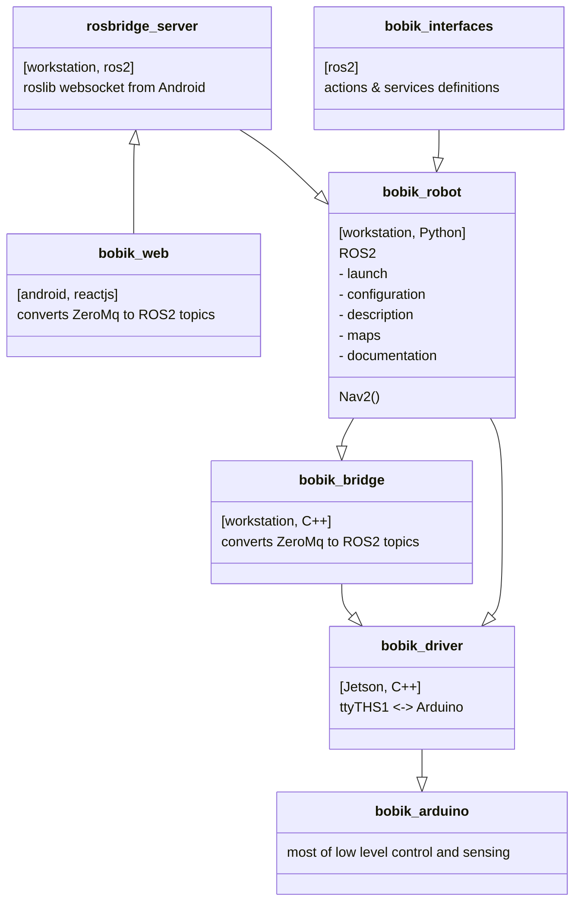

# Bobik the Robot - High Level package

Bobik's resources are split accros multiple git repositories.

- [bobik_robot (this repo)](https://github.com/slesinger/bobik_robot) All ROS2 stuff
- [bobik_bridge](https://github.com/slesinger/bobik_bridge) ZeroMQ to ROS2 topics bridge
- [bobik_driver](https://github.com/slesinger/bobik_driver) Jetson installation + pinout, C++ code ZeroMQ topics to Arduino serial
- [bobik_arduino](https://github.com/slesinger/bobik_arduino) Platform.io code, Arduino pinout




> Diagram crafted in [live ditor](https://mermaid-js.github.io/mermaid-live-editor)
# Documentation
[CAD](https://github.com/slesinger/bobik_robot/tree/main/docs/CAD)

[Mechanical](https://github.com/slesinger/bobik_robot/tree/main/docs/mechanical)

[Electrical](https://github.com/slesinger/bobik_robot/tree/main/docs/electrical)

[Software](https://github.com/slesinger/bobik_robot/tree/main/docs/software)

[Workstation Install](https://github.com/slesinger/bobik_robot/blob/main/README.md#installation)

[Jetson Install](https://github.com/slesinger/bobik_driver#build)


# Installation

## Install ROS2
```
sudo aptitude install ros-foxy-robot-localization ros-foxy-imu-tools 
```

## Setup WiFi
https://huobur.medium.com/how-to-setup-wifi-on-raspberry-pi-4-with-ubuntu-20-04-lts-64-bit-arm-server-ceb02303e49b

> RPI 3 has only 2.4

## .bashrc
Bacause of [bug in rviz to display cylinders](https://answers.ros.org/question/389967/urdf-and-rviz2-cylinder-not-showing/)
```
echo 'export LC_NUMERIC="en_US.UTF-8"' >>~/.bashrc
```

## Web Hosting

Apache HTTPD server is assumed.
Copy to 
- /etc/ssl/private/server.key
- /etc/ssl/certs/server.crt
- /etc/apache2/sites-available/010-bobik.conf

Create symlink
```
sudo ln -s /etc/apache2/sites-available/010-bobik.conf /etc/apache2/sites-enabled
```

```
sudo a2enmod ssl
```

```
npm run build
cp build/* /var/www/vhosts/bobik/
```

### Bobik_robot Build

Recommended to use Bobik build script
```
Usage:
./bobik_build.sh robot
./bobik_build.sh bridge
./bobik_build.sh arduino
./bobik_build.sh web
./bobik_build.sh interfaces
./bobik_build.sh description
./bobik_build.sh gazebo
```

The ```bobik_build.sh``` has to be symlinked from ```~/ros2_foxy/src/bobik_robot/scripts/bobik_build.sh``` to ```~/ros2_foxy/bobik_build.sh```.

```
cd ~/ros2_foxy
clear && colcon --log-level INFO build --packages-select bobik_robot
```

## URDF

### Jupiter Live Editor
https://github.com/ihuicatl/jupyterlab-urdf

### Mesh edits
Use Meshalab to reduce number of triangles. Filters > Remeshing, Simplification and Reconstruction > Simplification: Quadratic Edge Collapse Decimation.

No idea how to export textures with Collada dae files. Alternative is set URDF ```<material texture="medvidek.jpg" />``` in ```<visual>```. No UV mapping is possible, though.

# Startup
```
clear && ros2 launch bobik_robot bobik_robot.launch.py
```

# Teleop
```
ros2 run teleop_twist_keyboard teleop_twist_keyboard
```

# ROS Bridge
```
ros2 launch bobik_robot rosbridge_websocket_launch.xml ssl:=true certfile:=/home/honza/projects/bobik/bobik_web/cert/server.crt keyfile:=/home/honza/projects/bobik/bobik_web/cert/server.key
```

# Nav2
ros2 run tf2_ros static_transform_publisher "0" "0" "0" "0" "0" "0" "base_link" "odom"

# Operation

## Practical snippets
```
rte /odom | grep -v '\- 0.0'
ros2 run nav2_map_server map_saver_cli -f ~/ros2_foxy/src/bobik_robot/maps/place --ros-args -p save_map_timeout:=10000

# SLAM Toolbox - Serialize Map does not work
ros2 service call /slam_toolbox/serialize_map "slam_toolbox/SerializePoseGraph" "{'filename': 'husky_serialize'}"
```
#### TF
```
ros2 run tf2_ros tf2_echo odom map
ros2 run tf2_tools view_frames.py
rqt_graph
```

### Move
```
ros2 topic pub -r 20 -t 100 /cmd_vel geometry_msgs/msg/Twist '{linear: {x: 0.4, y: 0.0, z: 0.0}, angular: {x: 0.0, y: 0.0, z: 0.0}}'
ros2 topic pub -r 20 -t 100 /cmd_vel geometry_msgs/msg/Twist '{linear: {x: -0.2, y: 0.3464, z: 0.0}, angular: {x: 0.0, y: 0.0, z: 0.0}}'
```
