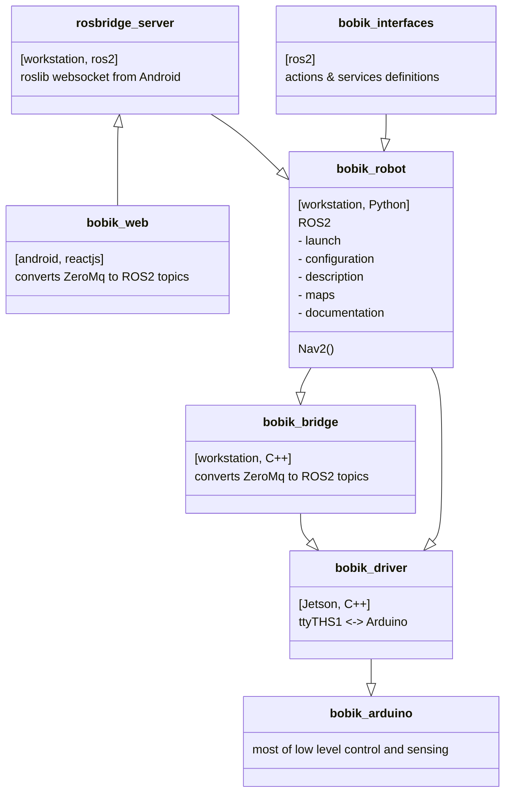

# Bobik the Robot - High Level package

Bobik's resources are split accros multiple git repositories.

- [bobik_robot (this repo)](https://github.com/slesinger/bobik_robot) All ROS2 stuff
- [bobik_bridge](https://github.com/slesinger/bobik_bridge) ZeroMQ to ROS2 topics bridge
- [bobik_driver](https://github.com/slesinger/bobik_driver) Jetson installation + pinout, C++ code ZeroMQ topics to Arduino serial
- [bobik_arduino](https://github.com/slesinger/bobik_arduino) Platform.io code, Arduino pinout




> Diagram crafted in [live ditor](https://mermaid-js.github.io/mermaid-live-editor)
# Documentation
[CAD](https://github.com/slesinger/bobik_robot/tree/main/docs/CAD)

[Mechanical](https://github.com/slesinger/bobik_robot/tree/main/docs/mechanical)

[Electrical](https://github.com/slesinger/bobik_robot/tree/main/docs/electrical)

[Software](https://github.com/slesinger/bobik_robot/tree/main/docs/software)

[Workstation Install](https://github.com/slesinger/bobik_robot/blob/main/README.md#installation)

[Jetson Install](https://github.com/slesinger/bobik_driver#build)


# Installation

## Install ROS2
```
sudo aptitude install ros-foxy-robot-localization
```

## Setup WiFi
https://huobur.medium.com/how-to-setup-wifi-on-raspberry-pi-4-with-ubuntu-20-04-lts-64-bit-arm-server-ceb02303e49b

> RPI 3 has only 2.4

## .bashrc
Bacause of [bug in rviz to display cylinders](https://answers.ros.org/question/389967/urdf-and-rviz2-cylinder-not-showing/)
```
echo 'export LC_NUMERIC="en_US.UTF-8"' >>~/.bashrc
```

## Mesh edits
Use Meshalab to reduce number of triangles. Filters > Remeshing, Simplification and Reconstruction > Simplification: Quadratic Edge Collapse Decimation.

No idea how to export textures with Collada dae files. Alternative is set URDF ```<material texture="medvidek.jpg" />``` in ```<visual>```. No UV mapping is possible, though.

# Startup
```
clear && ros2 launch bobik_robot bobik_robot.launch.py
```

# Teleop
```
ros2 run teleop_twist_keyboard teleop_twist_keyboard
```

# Nav2
ros2 run tf2_ros static_transform_publisher "0" "0" "0" "0" "0" "0" "base_link" "odom"
